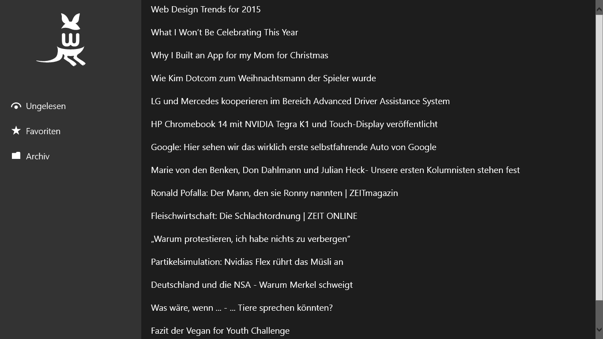
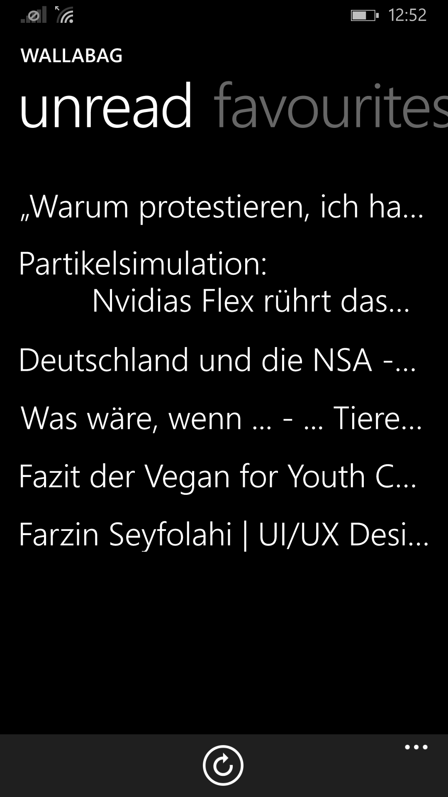

wallabag for Windows
================
**[Download it from the Windows Phone Store](http://www.windowsphone.com/en-US/store/app/wallabag/d5226cf1-f422-4e00-996c-88e9c5233332)!**
(*[Alternatively use the old app for WP7 devices.](http://www.windowsphone.com/en-us/store/app/wallabag/ff890514-348c-4d0b-9b43-153fff3f7450)*)

## Current features
- Read your saved articles on the go - even offline!

## Planned features (with wallabag v2)
- Add new articles easily to wallabag
- Mark articles as read
- Make downloading of pictures optional

## Currently supported languages
- English
- German
- French

## Improve the app!
You can simply fork this repository and add some nice features to it.
And even if you're not a developer, **you can help to translate it!**

## Screenshots
**Windows.**

**Windows Phone.**
|

## Why are the screenshots for Windows Phone in the store so bad?
First of all, sorry for that. My PC is not the newest one, the CPU has no support for the Hyper-V virtualization required by the Windows Phone Emulator.
Even if I use my Lumia 930 for the screenshots, Microsoft is not happy. They want the screenshots in a resolution of 1280x768. So the screenshots I made on the phone have to be resized and stretched - so they look very ugly.
If I will get a new PC, the screenshots are going to become an update.
