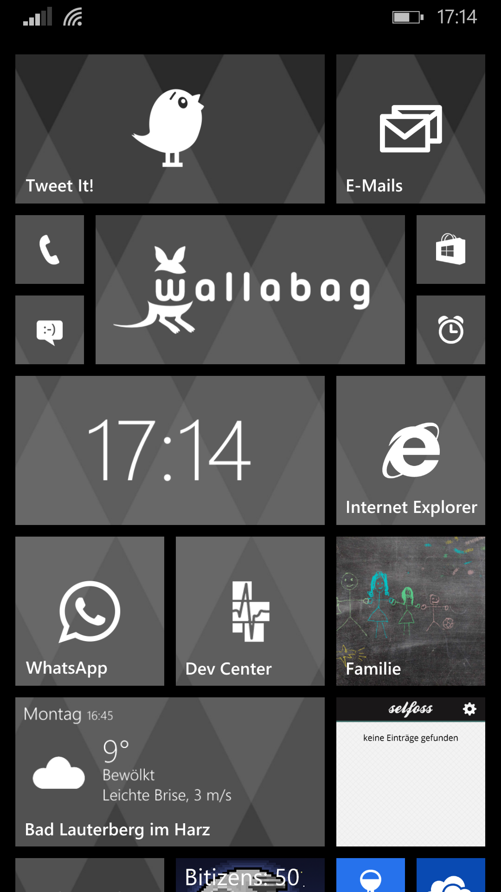
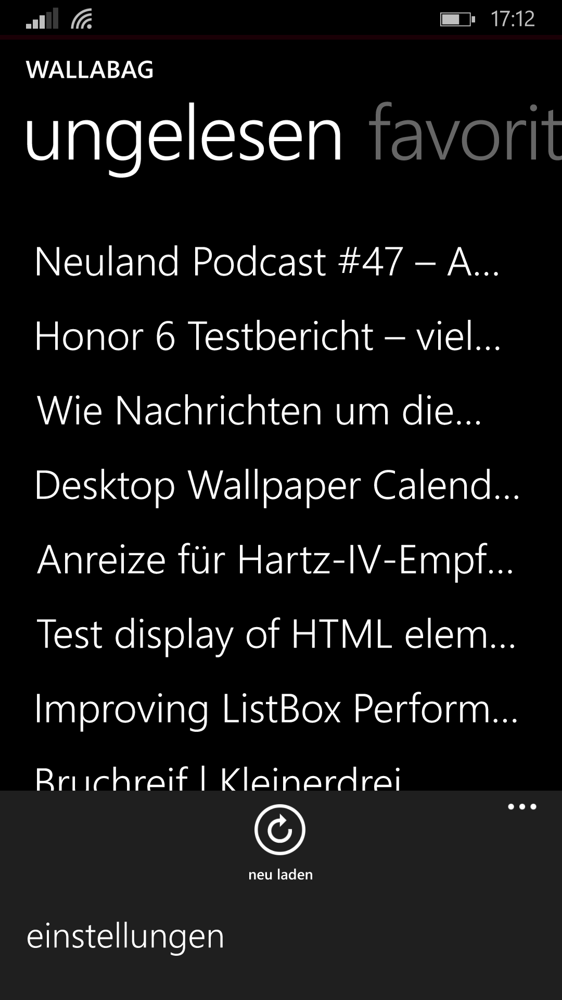
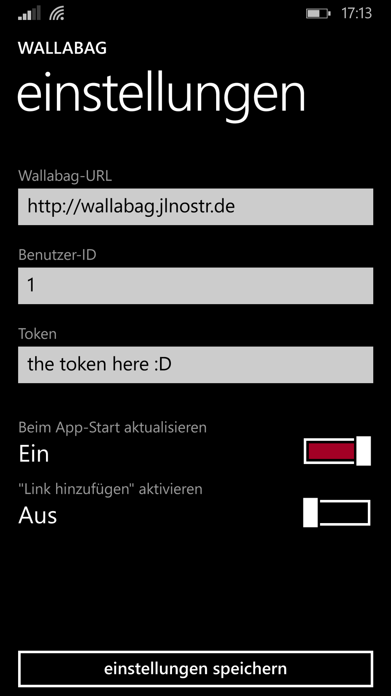

wallabag for Windows
================
**Currently it's not in the Windows Store. It'll change that soon!**
In the meantime, you can [use the old app from the Store](http://www.windowsphone.com/en-us/store/app/wallabag/ff890514-348c-4d0b-9b43-153fff3f7450).

This is a windows app for [wallabag](http://wallabag.org).
The old wallabag app for windows devices was crap on new devices (Windows Phone 8 and newer), so I started a new one.

It's not perfect, but I think the main issues will be fixed soon.

Unlike the old app, this app is an universal app. Sadly, it only supports Windows Phone at the moment, but I am working on the Desktop app.

## Currently supported languages
- English
- German
- French

## Screenshots
### Windows Phone

And yes I know, the single article view is not very beautiful and 
readable ;-)

## ToDo
[ ] Offline mode
[ ] easily switch between articles (FlipView)
[ ] share the URL of an article
[ ] Fix the app crashes.

## Improve the app!
You can simply fork this repository and add some nice features to it.
And even if you're not a developer, **you can help to translate it!**
